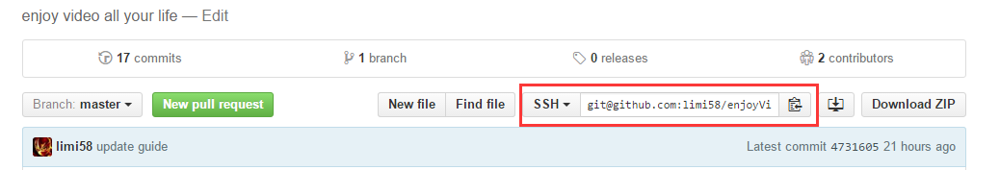

# 以这个EV项目为例的git教程（当然也适用所有的git）
虽然东西多，反正下面跟着一步一步来就可以了，主要是前期配置略烦

## 注册github
网址：https://github.com 这很简单了吧

## 安装git
[下载git](https://git-for-windows.github.io/)，然后安装，一直下一步（安装路径自己选）  

## 安装生效
安装完成之后打开命令行，输入 `git --version` ，如果成功出现版本号的话就成功了；如果没有就挨重启，但是如果你想马上生效又不想重启呢，那就在命令行把你刚刚装的git所在目录的bin目录set进环境变量；如果不会set呢，噗噗噗那只有重启吧

## 最后配置
```
$ git config --global user.name "你github用户名"
$ git config --global user.email "你github邮箱"
```

## 配置SSH（可选，但是强烈建议）
为毛强烈建议？不然以后每次push和pull都要输入用户名和密码，手会断的  
官方参考：https://help.github.com/articles/generating-ssh-keys/  
```
$ ssh-keygen -t rsa -b 4096 -C "你注册的邮箱"
```
然后一路回车，然后最后会出现这样的成功信息：
```
Your identification has been saved in /Users/you/.ssh/id_rsa.
Your public key has been saved in /Users/you/.ssh/id_rsa.pub.
The key fingerprint is:
01:0f:f4:3b:ca:85:d6:17:a1:7d:f0:68:9d:f0:a2:db your_email@example.com
```
然后在开始-程序里找到git bash，打开，输入
```
$ ssh-add ~/.ssh/id_rsa
```
然后继续在git bash里
```
$ clip < ~/.ssh/id_rsa.pub
```
这样的话ssh key就在你的剪贴板里了，不信粘贴出来看看  
然后打开github.com，进入setting，如图  
  
在用户设置侧边栏选择SSH keys，如图  
  
点击Add SSH key.如图  
  
在title字段里随便填，一般填你的设备名字，然后key里就填你刚刚剪贴板里面的东西，如图  
  
最后add key  
为了验证到底添加ssh成功没，继续在git bash里：
```
$ ssh -T git@github.com
```
如要选择yes no就填yes，如果出现下面的，就成功了:
```
Hi username! You've successfully authenticated, but GitHub does not
provide shell access.
```
不成功的话就看看前面步骤对不对，实在不行就群里@米不过分吧~。~

## clone到本地
因为这个EV项目是在远程嘛，所以要把它克隆到本地，很简单

在这个项目首页复制SSH地址（别复制成HTTPs的了），如图



然后在任意你喜欢的文件夹下按住shift不放，然后右键，选择“在此处打开命令窗口”，然后：(clone你刚刚复制的ssh地址)
```
$ git clone git@github.com:limi58/enjoyVideo.git
```

完了成功之后是不是出现了项目文件夹了！

## 更新本地项目
比如西瓜刚刚push了新番号，我想立即同步到本地咋办？很简单，把命令行定位到项目根目录，然后：
```
$ git pull
```
注意看提示，如果失败说明你们冲突了，冲突的话记得在群里吼一声，要协同解决冲突

## push到远程
自己添加了新番号要推送到远程咋办？也很简单

首先添加代码到暂存区：
```
$ git add -A
```
然后提交
```
$ git commit -m "这里面填你这次更新信息（尽量用英文）"
```
然后拉取最新代码（如果有最新的话）
```
$ git pull
```
最后push到远程
```
$ git push origin master
```
OK大功告成！

## 文档格式
github可以用markdown来控制文本的格式样式，比如字体大小和代码样式，markdown很简单，百度一下即可一晚上学会

## 总结
就是配置略麻烦，然后以后的工作流就是：拉取代码————推送代码。就酱

写的很粗糙和简单，可以看详细中文教程：http://www.liaoxuefeng.com/wiki/0013739516305929606dd18361248578c67b8067c8c017b000/